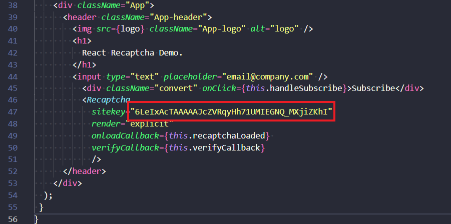

# ReCaptcha Google

Install package
``npm install --save react-recaptcha``

Add this line in your document HTML
``` <script src="https://www.google.com/recaptcha/api.js?onload=onloadCallback&render=explicit" async defer></script>```

Add this block of code where you want the recaprcha to be rendered
``` <Recaptcha ```
``` sitekey="xxxxxxxxxxxxxxxxxxxx" ```
``` render="explicit" ```
``` onloadCallback={callback} ```
``` /> ```

### Site Key
You can register your key [here](https://www.google.com/recaptcha/admin/create)
Put your site key in the red tag


